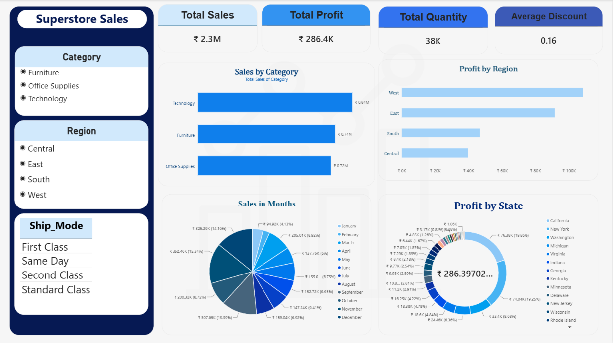

<div align="center">


<br/>


<br/>

[](https://drive.google.com/file/d/1QfPEpqiF4ozBXMDx2iXPjwqMsSe9vcWq/view?usp=drive_link)
[](#-dashboard-preview)
[](#-results--insights)
[](#-how-to-open--use)

<br/>

> 🚀 A **single-page Power BI report** that turns **9,994 Superstore order lines (2014–2017)** into an interactive dashboard — 4 KPI cards, 4 charts, 2 slicers and a Ship Mode list — so sales, profit, category, region, month and state performance can be explored in real time.

</div>

---

## 📑 Table of Contents

1. [Overview](#-overview)
2. [Problem Statement](#-problem-statement)
3. [Features](#-features)
4. [Key Features](#-key-features)
5. [Project Structure](#-project-structure)
6. [Dashboard Layout](#-dashboard-layout)
7. [Data Preparation (Power Query)](#-data-preparation-power-query)
8. [Data Model & Fields](#-data-model--fields)
9. [Panel 1 — KPI Cards](#-panel-1--kpi-cards)
10. [Panel 2 — Filters](#-panel-2--filters)
11. [Panel 3 — Sales by Category](#-panel-3--sales-by-category)
12. [Panel 4 — Profit by Region](#-panel-4--profit-by-region)
13. [Panel 5 — Sales in Months](#-panel-5--sales-in-months)
14. [Panel 6 — Profit by State](#-panel-6--profit-by-state)
15. [Tech Stack](#-tech-stack)
16. [Results & Insights](#-results--insights)
17. [Advantages](#-advantages)
18. [How to Open & Use](#-how-to-open--use)
19. [Project Presentation](#-project-presentation)
20. [Dashboard Preview](#-dashboard-preview)
21. [License](#-license)
22. [Author](#-author)
23. [Acknowledgements](#-acknowledgements)

---

## 🔭 Overview

**Superstore Sales Dashboard** is a single-page `.pbix` report built on the **Sample - Superstore** dataset — **9,994 order lines** placed between **3 Jan 2014 and 30 Dec 2017**. A dark-navy sidebar holds the filters (Category slicer, Region slicer and a Ship_Mode list), while the main canvas shows four headline KPI cards and four charts: two bar charts, a pie chart and a donut chart.

Every visual is **live and connected** to one data model — choose a Region or Category and the KPI cards and charts update together, with no formulas to edit. All KPIs use Power BI's **implicit aggregations** (Sum and Average), so the report needs no custom DAX.

<div align="center">

| 💰 **₹2.3M** | 📈 **₹286.4K** | 📦 **38K** | 🏷️ **0.16** |
|:---:|:---:|:---:|:---:|
| Total Sales | Total Profit | Total Quantity | Average Discount |

</div>

---

## ❗ Problem Statement

A raw table of ~10,000 order lines — with sales, profit, discount, quantity, category, region, state and ship mode — is hard to read as rows and columns. Sales managers need quick answers to questions like:

- 💰 What are the total sales, profit, quantity and average discount for whatever filter is applied?
- 🗂️ Which product category brings in the most revenue?
- 🗺️ Which region is the most profitable, and which one lags behind?
- 📅 In which months do sales peak?
- 🍩 Which states generate the most profit — and which ones lose money?

**Superstore Sales Dashboard** answers all of these on **one interactive canvas**.

---

## ✨ Features

| Feature | Visual | Description |
|---|---|---|
| 💰 **Total Sales** | Card | Sum of `Sales` for the current filter |
| 📈 **Total Profit** | Card | Sum of `Profit` for the current filter |
| 📦 **Total Quantity** | Card | Sum of `Quantity` (units sold) |
| 🏷️ **Average Discount** | Card | Average of `Discount` |
| 🗂️ **Category Filter** | List Slicer | Furniture / Office Supplies / Technology |
| 🌍 **Region Filter** | List Slicer | Central / East / South / West |
| 🚚 **Ship_Mode List** | Table | First Class, Same Day, Second Class, Standard Class |
| 📊 **Sales by Category** | Clustered Bar Chart | Total sales per product category |
| 🗺️ **Profit by Region** | Clustered Bar Chart | Total profit per region |
| 📅 **Sales in Months** | Pie Chart | Sales by calendar month (Date Hierarchy → Month) |
| 🍩 **Profit by State** | Donut Chart | State-level profit share, with the net total in the centre |

---

## 🌟 Key Features

| Feature | Description |
|---|---|
| 🔗 **One Connected Model** | All 11 data visuals read from a single table, so filters apply consistently across the page |
| 🧮 **Implicit Aggregations** | Cards and charts use Sum / Average over columns — no hardcoded numbers |
| 📅 **Auto Date Hierarchy** | The monthly pie chart is built on Power BI's automatic Date Hierarchy at the **Month** level |
| 🧪 **Documented Data Prep** | A 10-step Power Query pipeline cleans types, renames columns and splits `Order_ID` |
| 🎨 **Branded Design** | Navy sidebar, Fluent 2 base theme plus a custom theme, and a faint background watermark |
| 🖼️ **Fit-to-Page Canvas** | Designed at 1920 × 1080 with *Fit to page*, so it scales across screen sizes |
| ♻️ **Native Visuals Only** | Card, Clustered Bar, Pie, Donut, Table and List Slicer |

---

## 📁 Project Structure

```
📦 Superstore-Sales-Dashboard/
 ┣ 📄 README.md                         ← Project documentation (you're here!)
 ┣ 📊 Superstore_Sales_Dashboard.pbix   ← Power BI report (1 page: "Dashboard")
 ┣ 🗃️ Sample_-_Superstore.csv           ← Source data (9,994 rows × 21 columns)
 ┣ 🖼️ dashboard_overview.png            ← Dashboard screenshot
 ┗ 📁 assets/
    ┣ 🎨 banner.svg                     ← README header banner
    ┗ 🎞️ video_thumbnail.png            ← Clickable video thumbnail
```

> 🎬 The **project presentation video** is hosted on **Google Drive** — [watch it here](https://drive.google.com/file/d/1QfPEpqiF4ozBXMDx2iXPjwqMsSe9vcWq/view?usp=drive_link).

---

## 🖥️ Dashboard Layout

```
┌──────────────────────┬─────────────────────────────────────────────────────┐
│   SUPERSTORE SALES   │┌────────────┬────────────┬────────────┬────────────┐│
│                      ││Total Sales │Total Profit│ Total Qty  │Avg Discount││
│ Category (slicer)    │└────────────┴────────────┴────────────┴────────────┘│
│ o Furniture          │┌─────────────────────────┬─────────────────────────┐│
│ o Office Supplies    ││ Sales by Category       │ Profit by Region        ││
│ o Technology         ││ (clustered bar)         │ (clustered bar)         ││
│                      ││                         │                         ││
│ Region (slicer)      ││                         │                         ││
│ o Central            │└─────────────────────────┴─────────────────────────┘│
│ o East               │┌─────────────────────────┬─────────────────────────┐│
│ o South              ││ Sales in Months         │ Profit by State         ││
│ o West               ││ (pie, by month)         │ (donut, with total)     ││
│                      ││                         │                         ││
│ Ship_Mode (table)    ││                         │                         ││
│ First Class          │└─────────────────────────┴─────────────────────────┘│
│ Same Day             │                                                     │
│ Second Class         │                                                     │
│ Standard Class       │                                                     │
└──────────────────────┴─────────────────────────────────────────────────────┘
```

---

## 🧪 Data Preparation (Power Query)

The `Sample - Superstore` table is loaded from a CSV file and cleaned with these Power Query (M) steps:

| # | Step | What it does |
|:---:|---|---|
| 1️⃣ | **Load CSV** | Reads `Sample - Superstore.csv` (comma-delimited, 21 columns) |
| 2️⃣ | **Promote headers** | Uses the first row as column names |
| 3️⃣ | **Set data types** | Whole numbers, text, dates and decimals assigned to every column |
| 4️⃣ | **Remove column** | Drops `Row ID` |
| 5️⃣ | **Re-type numeric columns** | `Quantity` → whole number; `Sales`, `Profit` → currency; `Discount` set back to a decimal number |
| 6️⃣ | **Rename columns** | Spaces and hyphens become underscores (`Order_Date`, `Ship_Date`, `Ship_Mode`, `Customer_ID`, `Customer_Name`, `Product_ID`, `Sub_Category`, …) |
| 7️⃣ | **Remove columns** | Drops `Country` and `Postal_Code` |
| 8️⃣ | **Replace value** | In `Segment`, **"Home Office" → "Consumer"** (leaving two segments: Consumer and Corporate) |
| 9️⃣ | **Split `Order_ID`** | Splits on `-` into `Order_ID.1` (prefix: CA / US), `Order_ID.2` (year), `Order_ID.3` (number) |
| 🔟 | **Final types** | `Order_ID.1` → text; `Order_ID.2` and `Order_ID.3` → whole number |

---

## 📋 Data Model & Fields

**📌 Dataset at a glance**

| Metric | Value |
|---|---|
| 🧾 Rows (order lines) | **9,994** |
| 🧱 Columns | **20** (after Power Query) |
| 📆 Order date range | **3 Jan 2014 → 30 Dec 2017** (4 years) |
| 👥 Customers · 📦 Products · 🏙️ Cities | 793 · 1,862 · 531 |
| 🗺️ States · 🏷️ Sub-categories | 49 · 17 |
| 🧑‍💼 Segments | Consumer (6,974) · Corporate (3,020) |

**📌 Fields used on the dashboard**

| Field | Used In |
|---|---|
| `Sales` | Total Sales card · Sales by Category · Sales in Months |
| `Profit` | Total Profit card · Profit by Region · Profit by State |
| `Quantity` | Total Quantity card |
| `Discount` | Average Discount card |
| `Category` | Category slicer · Sales by Category |
| `Region` | Region slicer · Profit by Region |
| `State` | Profit by State |
| `Order_Date` | Sales in Months (Date Hierarchy → Month) |
| `Ship_Mode` | Ship_Mode table |

**📌 Extra fields loaded and ready for new pages** — `Ship_Date`, `Order_ID.1/.2/.3`, `Customer_ID`, `Customer_Name`, `Segment`, `City`, `Product_ID`, `Sub_Category`, `Product Name`.

---

## 💰 Panel 1 — KPI Cards

> Four native **Card** visuals, each showing one aggregated field.

| Card | Field | Aggregation | Shown on dashboard | Exact value |
|---|---|---|---|---|
| 💰 Total Sales | `Sales` | Sum | **₹2.3M** | ₹2,297,200.86 |
| 📈 Total Profit | `Profit` | Sum | **₹286.4K** | ₹286,397.02 |
| 📦 Total Quantity | `Quantity` | Sum | **38K** | 37,873 units |
| 🏷️ Average Discount | `Discount` | Average | **0.16** | 0.1562 (15.62%) |

> [!TIP]
> ✅ **Reading it:** profit is **12.47%** of sales (₹286,397.02 ÷ ₹2,297,200.86), and the average order-line discount is **15.6%**.

---

## 🎛️ Panel 2 — Filters

> Two **List Slicers** and one **Table**, all in the left sidebar.

| Control | Type | Field | Values |
|---|---|---|---|
| 🗂️ **Category** | List Slicer | `Category` | Furniture, Office Supplies, Technology |
| 🌍 **Region** | List Slicer | `Region` | Central, East, South, West |
| 🚚 **Ship_Mode** | Table | `Ship_Mode` | First Class, Same Day, Second Class, Standard Class |

---

## 📊 Panel 3 — Sales by Category

> A **Clustered Bar Chart** of total sales per category (chart subtitle: *"Total Sales of Category"*).

| Field Role | Field |
|---|---|
| Axis | `Category` |
| Values | Sum of `Sales` |

| Category | Total Sales | Shown on chart | Share | Visual |
|---|---|---|---|---|
| 🥇 Technology | ₹836,154.03 | ₹0.84M | 36.40% | 🟦🟦🟦🟦🟦🟦🟦🟦🟦 |
| 🥈 Furniture | ₹741,999.80 | ₹0.74M | 32.30% | 🟦🟦🟦🟦🟦🟦🟦🟦 |
| 🥉 Office Supplies | ₹719,047.03 | ₹0.72M | 31.30% | 🟦🟦🟦🟦🟦🟦🟦🟦 |

> [!TIP]
> ✅ **Reading it:** Technology leads, and the three categories are close — each contributes between **31% and 36%** of sales.

---

## 🗺️ Panel 4 — Profit by Region

> A **Clustered Bar Chart** of total profit per region.

| Field Role | Field |
|---|---|
| Axis | `Region` |
| Values | Sum of `Profit` |

| Region | Total Profit | Share of Profit | Visual |
|---|---|---|---|
| 🥇 West | ₹108,418.45 | 37.86% | 🟧🟧🟧🟧🟧🟧🟧🟧🟧 |
| 🥈 East | ₹91,522.78 | 31.96% | 🟧🟧🟧🟧🟧🟧🟧🟧 |
| 🥉 South | ₹46,749.43 | 16.32% | 🟧🟧🟧🟧 |
| 4️⃣ Central | ₹39,706.36 | 13.86% | 🟧🟧🟧 |

> [!TIP]
> ✅ **Reading it:** **West and East together produce 69.8%** of all profit. West earns about **2.7×** as much as Central, the weakest region.

---

## 📅 Panel 5 — Sales in Months

> A **Pie Chart** built on the automatic **Date Hierarchy** of `Order_Date`, at the **Month** level.

> [!NOTE]
> **How to read it:** the chart adds up the **same calendar month across all four years (2014–2017)**, so it shows overall seasonality rather than a single year.

| Field Role | Field |
|---|---|
| Category | `Order_Date` → Date Hierarchy → **Month** |
| Values | Sum of `Sales` |

| Month | Sales | Shown on chart | Share | Visual |
|---|---|---|---|---|
| January | ₹94,924.84 | ₹94.92K | 4.13% | 🟪🟪🟪 |
| February | ₹59,751.25 | *(label hidden — slice too small)* | 2.60% | 🟪🟪 |
| March | ₹205,005.49 | ₹205.01K | 8.92% | 🟪🟪🟪🟪🟪🟪 |
| April | ₹137,762.13 | ₹137.76K | 6.00% | 🟪🟪🟪🟪 |
| May | ₹155,028.81 | ₹155.0K | 6.75% | 🟪🟪🟪🟪 |
| June | ₹152,718.68 | ₹152.72K | 6.65% | 🟪🟪🟪🟪 |
| July | ₹147,238.10 | ₹147.24K | 6.41% | 🟪🟪🟪🟪 |
| August | ₹159,044.06 | ₹159.04K | 6.92% | 🟪🟪🟪🟪🟪 |
| 🔥 September | ₹307,649.95 | ₹307.65K | 13.39% | 🟪🟪🟪🟪🟪🟪🟪🟪🟪 |
| October | ₹200,322.98 | ₹200.32K | 8.72% | 🟪🟪🟪🟪🟪🟪 |
| 🔥 November | ₹352,461.07 | ₹352.46K | 15.34% | 🟪🟪🟪🟪🟪🟪🟪🟪🟪🟪 |
| 🔥 December | ₹325,293.50 | ₹325.29K | 14.16% | 🟪🟪🟪🟪🟪🟪🟪🟪🟪 |

> [!TIP]
> ✅ **Reading it:** **November, December and September** (🔥) are the three biggest months and together account for **42.9%** of sales. **January and February** are the weakest, at just **6.7%** combined.

---

## 🍩 Panel 6 — Profit by State

> A **Donut Chart** with the **net** total profit (**₹286.39K**) shown in the centre.

| Field Role | Field |
|---|---|
| Category | `State` |
| Values | Sum of `Profit` |

| Rank | State | Profit | Donut share | Visual |
|:---:|---|---|---|---|
| 🥇 | California | ₹76,381.39 | 19.86% | 🟩🟩🟩🟩🟩🟩🟩🟩🟩🟩 |
| 🥈 | New York | ₹74,038.55 | 19.25% | 🟩🟩🟩🟩🟩🟩🟩🟩🟩🟩 |
| 🥉 | Washington | ₹33,402.65 | 8.68% | 🟩🟩🟩🟩 |
| 4 | Michigan | ₹24,463.19 | 6.36% | 🟩🟩🟩 |
| 5 | Virginia | ₹18,597.95 | 4.84% | 🟩🟩 |
| 6 | Indiana | ₹18,382.94 | 4.78% | 🟩🟩 |
| 7 | Georgia | ₹16,250.04 | 4.22% | 🟩🟩 |
| 8 | Kentucky | ₹11,199.70 | 2.91% | 🟩 |
| 9 | Minnesota | ₹10,823.19 | 2.81% | 🟩 |
| 10 | Delaware | ₹9,977.37 | 2.59% | 🟩 |

> [!NOTE]
> **How to read the percentages:** a donut chart cannot draw negative values, so the shares above are calculated over the **39 profitable states** (₹384,643.76). The centre total of ₹286.39K is the **net** profit across all **49 states**.

**💸 Where profit is lost** — 10 states have negative profit, totalling **−₹98,246.74**. The five largest losses:

| State | Profit |
|---|---|
| 🔻 Texas | −₹25,729.36 |
| 🔻 Ohio | −₹16,971.38 |
| 🔻 Pennsylvania | −₹15,559.96 |
| 🔻 Illinois | −₹12,607.89 |
| 🔻 North Carolina | −₹7,490.91 |

> [!TIP]
> ✅ **Reading it:** **California and New York** together earn **₹150,419.94 — 52.5% of net profit**.

---

## 🛠 Tech Stack

| Technology | Purpose |
|---|---|
| 📊 **Power BI Desktop** | Report authoring, data modelling and visual design |
| 🧪 **Power Query (M)** | Loading and cleaning the CSV source |
| 🧮 **Power BI Data Model** | One data table plus auto-generated date tables |
| 📅 **Auto Date/Time Hierarchy** | Year → Quarter → Month → Day drilldown behind the monthly pie chart |
| 🎨 **Native Visuals** | Card, Clustered Bar Chart, Pie Chart, Donut Chart, Table, List Slicer |
| 🖼️ **Themes** | Fluent 2 base theme plus a custom theme file, with a background watermark image |
| 🎬 **Screen Recording** | Project presentation video (MP4, Full HD) |

---

## 🏆 Results & Insights

| Panel | Key Insight |
|---|---|
| 💰 **KPI Cards** | ₹2.30M sales → ₹286.4K profit (**12.47%** margin), 37,873 units, 15.6% average discount |
| 📊 **Sales by Category** | Technology leads at **36.4%**; the category mix is fairly balanced (31%–36% each) |
| 🗺️ **Profit by Region** | **West + East = 69.8%** of profit; **Central** is the weakest at 13.9% |
| 📅 **Sales in Months** | **Sep + Nov + Dec = 42.9%** of sales — strong year-end seasonality; Jan + Feb only 6.7% |
| 🍩 **Profit by State** | **California + New York = 52.5%** of net profit; **10 states** are loss-making, led by **Texas** (−₹25.7K) |

---

## 💡 Advantages

- ⚡ **Fully Interactive** — every card and chart responds to the slicers, with no static exports
- 🎯 **Compact but Complete** — one page covers sales, profit, time, geography and category
- 📚 **Well-Known Dataset** — built on Sample - Superstore, so it is easy to recreate or extend
- 🧪 **Transparent Data Prep** — all cleaning is done in Power Query and documented step by step
- 🧩 **Simple, Maintainable Logic** — implicit aggregations only, so there is no DAX to debug
- 🎨 **Native Visuals Only** — opens cleanly in any standard Power BI Desktop install
- 🎬 **Video Walkthrough Included** — a 5-minute presentation explains the report end to end
- 🌱 **Room to Grow** — 11 loaded fields (Customer, Segment, City, Sub_Category, Ship_Date, …) are ready for new pages

---

## ▶️ How to Open & Use

1. 🎬 **[Watch the project presentation on Google Drive](https://drive.google.com/file/d/1QfPEpqiF4ozBXMDx2iXPjwqMsSe9vcWq/view?usp=drive_link)** for a 5-minute tour.
2. 💻 Install **Power BI Desktop** (free, Windows).
3. 📂 Open `Superstore_Sales_Dashboard.pbix`. The data is stored inside the file, so the visuals load immediately.
4. 🖱️ Click items in the **Category** and **Region** slicers to filter every visual, or click a chart segment to cross-filter the rest of the page.
5. 🔄 **To refresh from your own copy of the CSV:** go to *Home → Transform data ▾ → Data source settings → Change Source…*, point it to `Sample - Superstore.csv`, then click **Refresh**.

---

## 🎬 Project Presentation

<div align="center">

<a href="https://drive.google.com/file/d/1QfPEpqiF4ozBXMDx2iXPjwqMsSe9vcWq/view?usp=drive_link">
  
</a>

**👆 Click the thumbnail to watch the full project presentation on Google Drive**

[](https://drive.google.com/file/d/1QfPEpqiF4ozBXMDx2iXPjwqMsSe9vcWq/view?usp=drive_link)

</div>

| 🎞️ Detail | Info |
|---|---|
| ☁️ **Hosted on** | Google Drive |
| ⏱️ **Duration** | 5 min 5 sec |
| 🖥️ **Quality** | 1920 × 1080 (Full HD), 30 fps |
| 🔊 **Format** | MP4 — H.264 video with AAC audio |
| 🎥 **Style** | Screen recording of Power BI Desktop, with presenter camera |

**What the video walks through**

| Step | What you will see |
|:---:|---|
| 🗃️ **1** | The **Data view** — the cleaned `Sample - Superstore` table (9,994 rows) with the split `Order_ID` columns |
| 📊 **2** | The finished **Dashboard** page with its KPI cards, bar charts, pie chart and donut chart |
| 🎛️ **3** | **Live filtering** with the Category and Region slicers — every card and chart updates together |

> [!TIP]
> **Live example from the video:** selecting *Furniture + Office Supplies* in the *East* region changes the cards to **₹413.81K sales · ₹44.06K profit · 8,676 units · 0.15 average discount**.

---

## 🖼️ Dashboard Preview

<div align="center">



*The complete dashboard: KPI cards on top, slicers on the left, four charts below.*

</div>

---

## 📄 License

```
MIT License

Copyright (c) 2026

Permission is hereby granted, free of charge, to any person obtaining a copy
of this software and associated documentation files (the "Software"), to deal
in the Software without restriction, including without limitation the rights
to use, copy, modify, merge, publish, distribute, sublicense, and/or sell
copies of the Software, subject to the following conditions:

The above copyright notice and this permission notice shall be included in
all copies or substantial portions of the Software.

THE SOFTWARE IS PROVIDED "AS IS", WITHOUT WARRANTY OF ANY KIND.
```

---

## 👩‍💻 Author

<div align="center">

| | |
|---|---|
| 👤 **Name** | _KRINA GHORI_ |
| 📊 **Tool** | Power BI Desktop |
| 📁 **Project** | Superstore Sales Dashboard |
| 💡 **Purpose** | Interactive sales, profit & regional analytics dashboard |

<br/>

Made with 💙 using **Power BI**


</div>

---

## 🙏 Acknowledgements

- 📊 **Microsoft Power BI Team** — for the report engine and visualization framework behind this dashboard
- 📖 **Sample - Superstore Dataset** — the widely used demo dataset behind this report
- 📖 **Power BI Documentation** — for reference on Power Query, Date Hierarchies, Cards and native chart visuals
- 💻 **Open Source Community** — for README badge tools (shields.io) and typing SVG animations
- 🎓 **All learners** — who build dashboards like this to sharpen their BI fundamentals

---

<div align="center">

⭐ **Star this repo if you found it helpful!** ⭐

</div>
